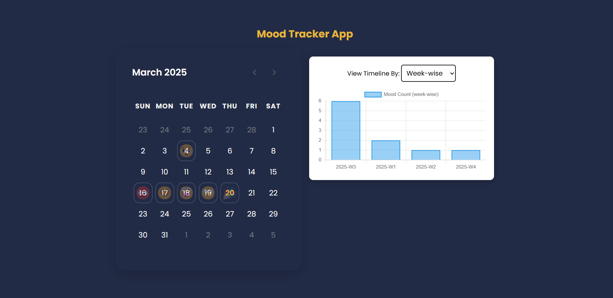
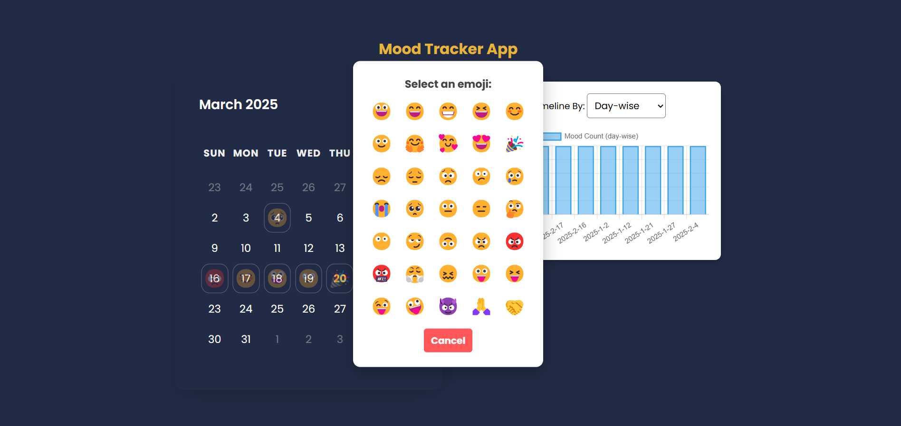
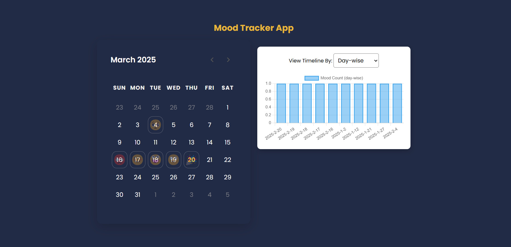
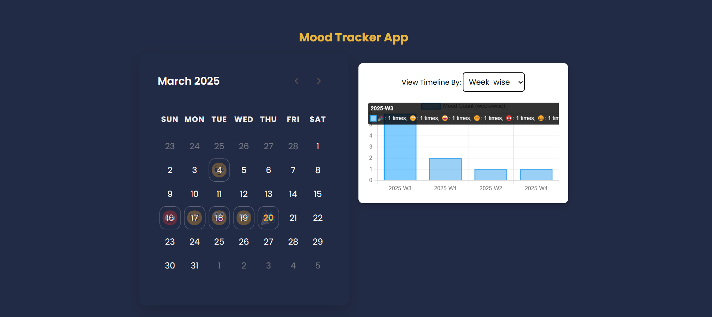
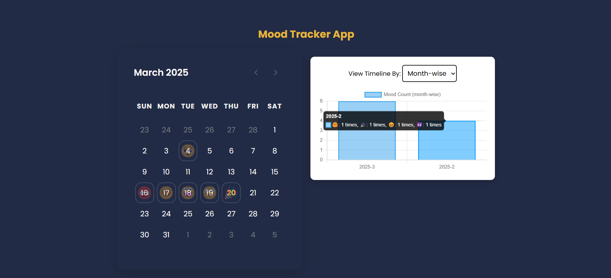
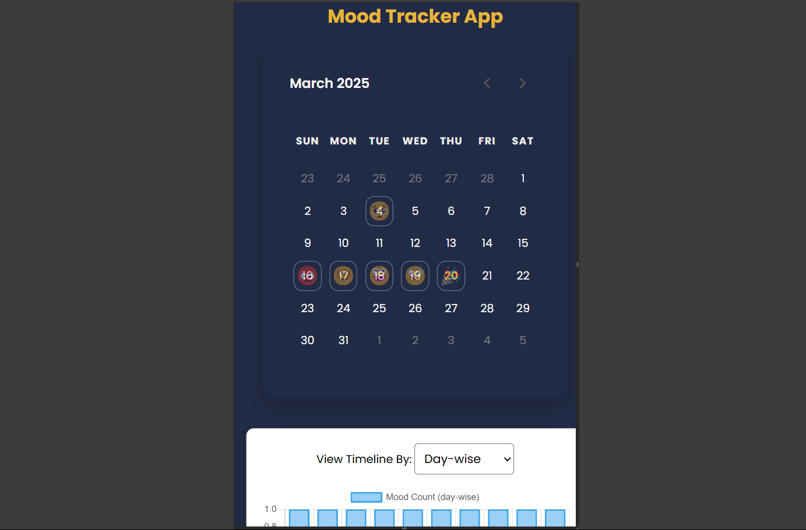

## 📅 Mood Calendar with Emoji Tracking 😊

### 🎯 Overview
This project is a JavaScript-based interactive calendar that allows users to track their daily moods using emojis. The selected emojis are stored in `localStorage` so that users can revisit their mood history.

### 🌟 Features
- **🗓 Interactive Calendar:** Users can select any date and assign an emoji representing their mood.
- **💾 Persistent Data:** Emoji selections are saved in `localStorage` for future reference.
- **⏪⏩ Navigation Controls:** Users can navigate between months to view and update past moods.
- **📊 Mood Timeline:** Users can visualize their mood patterns using a chart with daily, weekly, or monthly views.

### 🛠 Technologies Used
- 🏗 **HTML, CSS, JavaScript**
- 💾 **`localStorage` for data persistence**
- 📊 **Chart.js for data visualization**

### 📝 Code Highlights
#### 1️⃣ **Calendar Manipulation**
The `manipulate()` function generates the calendar structure dynamically:
```js
const manipulate = () => {
    let firstDay = new Date(year, month, 1).getDay();
    let lastDate = new Date(year, month + 1, 0).getDate();
    let lastDay = new Date(year, month, lastDate).getDay();
    let prevMonthLastDate = new Date(year, month, 0).getDate();

    let lit = "";
    
    for (let i = firstDay; i > 0; i--) {
        lit += `<li class="inactive">${prevMonthLastDate - i + 1}</li>`;
    }
    
    for (let i = 1; i <= lastDate; i++) {
        let key = `${year}-${month}-${i}`;
        let emoji = emojiData[key] || "";
        lit += `<li data-date="${key}" data-emoji="${emoji}">${i}</li>`;
    }
    
    currDate.innerText = `${months[month]} ${year}`;
    day.innerHTML = lit;
};
```
#### 2️⃣ **Storing and Retrieving Mood Data**
User-selected emojis are stored using `localStorage`:
```js
const showEmojiPopup = (selectedDate) => {
    let popup = document.createElement("div");
    popup.classList.add("emoji-popup");
    
    popup.innerHTML = `
        <p>Select an emoji:</p>
        <div class="emoji-options">
            ${availableEmojis.map(emoji => `<button class="emoji-btn">${emoji}</button>`).join("")}
        </div>
        <button class="close-btn">Cancel</button>
    `;
    
    document.body.appendChild(popup);
    
    document.querySelectorAll(".emoji-btn").forEach(btn => {
        btn.addEventListener("click", () => {
            emojiData[selectedDate] = btn.textContent;
            localStorage.setItem("emojiData", JSON.stringify(emojiData));
            document.body.removeChild(popup);
            manipulate();
        });
    });
};
```
#### 3️⃣ **📊 Mood Timeline Visualization**
Using Chart.js, the application generates bar charts showing mood trends over time:
```js
const renderMoodChart = (view) => {
    let moodData = getMoodTimeline(view);
    let labels = Object.keys(moodData);
    let moodCounts = labels.map(label => {
        if (view === "day") return 1;
        let emojiData = moodData[label];
        return Object.values(emojiData).reduce((sum, count) => sum + count, 0);
    });
    
    let ctx = document.getElementById("moodChart").getContext("2d");
    if (window.moodChartInstance) {
        window.moodChartInstance.destroy();
    }
    
    window.moodChartInstance = new Chart(ctx, {
        type: "bar",
        data: {
            labels: labels,
            datasets: [{
                label: `Mood Count (${view}-wise)`,
                data: moodCounts,
                backgroundColor: "rgba(54, 162, 235, 0.5)",
                borderColor: "rgba(54, 162, 235, 1)",
                borderWidth: 2
            }]
        },
        options: {
            responsive: true,
            scales: {
                y: { beginAtZero: true }
            }
        }
    });
};
```

### 🏗 How to Use
1️⃣ Open the web page and click on any date to select a mood.
2️⃣ Choose an emoji from the popup and save it.
3️⃣ Navigate between months to view and update past moods.
4️⃣ Use the dropdown menu to visualize mood patterns in different time frames.

### 🔮 Future Enhancements
- 📝 Add support for custom emoji input.
- 🌙 Implement a dark mode toggle.
- ☁️ Enable cloud sync for cross-device access.

## 📷Snapshots




#### Add emoji in date


#### Display Data In Day Wise


#### Display Data In Week Wise


#### Display Data In Month Wise


#### Responsive



## Finished ✨