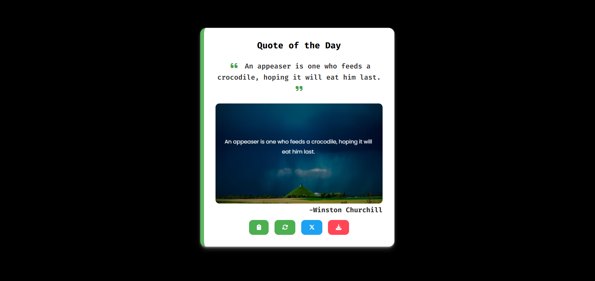
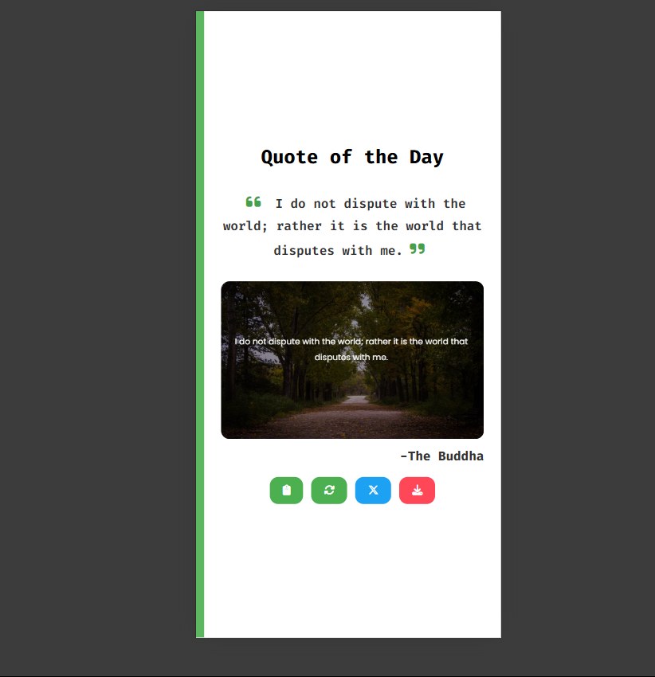
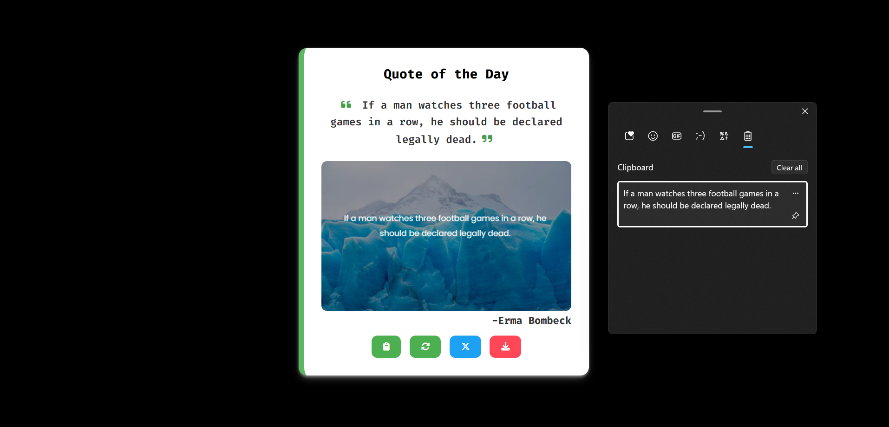
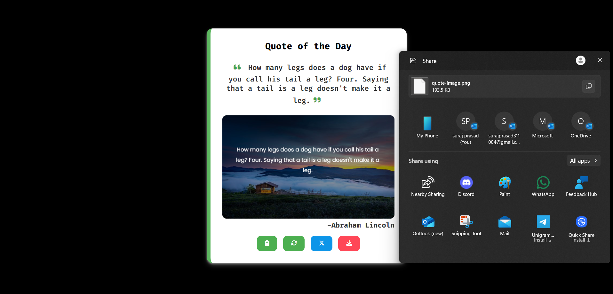
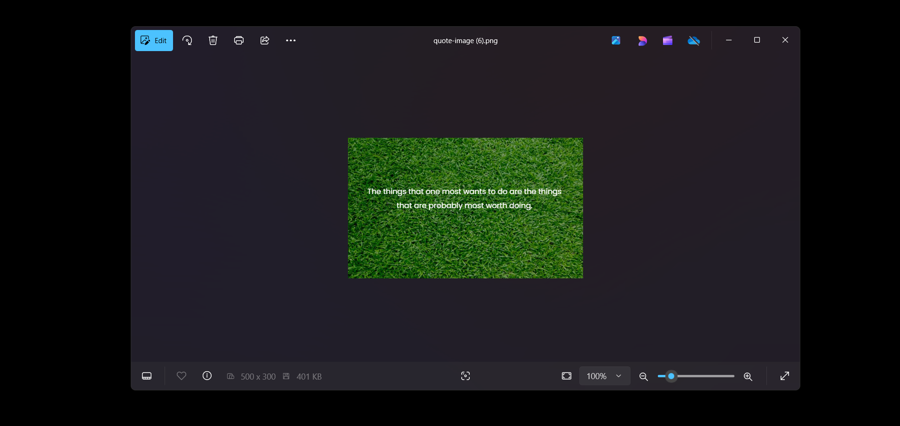

# 📜 Quote Generator with Image Background  

This JavaScript application fetches random quotes and overlays them on dynamically generated image backgrounds using the HTML5 Canvas API. Users can copy, share, or download the generated quote images.

## 📌 Features  

### 🔹 Fetch Random Quotes  
- Retrieves a new random quote from the API on each request.  
- Displays the quote along with the author's name.  

### 🔹 Copy to Clipboard  
- Users can copy the displayed quote with a single click.  
- A confirmation icon appears after successful copying.  

### 🔹 Share as Image  
- Converts the generated quote with the background into an image.  
- Uses the Web Share API to allow users to share the image.  

### 🔹 Random Background Images  
- Fetches a random **nature-themed** image using an external API.  
- Overlays the quote on the image using a semi-transparent black background.  

### 🔹 Download as Image  
- Allows users to download the generated quote with background as a **PNG file**.  

---

## 🚀 Implementation Details  

### 📜 Fetching Quotes  
```js
const uri = "https://api.freeapi.app/api/v1/public/quotes/quote/random";

const fetchQuote = async () => {
  try {
    const res = await fetch(uri);
    const obj = await res.json();
    currentQuote = `${obj.data.content}`;
    quoteElement.innerHTML = `<i class="fa-solid fa-quote-left"></i> ${currentQuote} <i class="fa-solid fa-quote-right"></i>`;
    quoteAuthor.textContent = `-${obj.data.author}`;
    drawQuoteOnImage();
  } catch (error) {
    console.error("Error fetching quote:", error);
    quoteElement.innerText = "Failed to load quote!";
  }
};
```
### 📷 Generating Random Images
```js
async function generateRandomImage() {
  const category = "nature";
  await fetch(
    "https://api.api-ninjas.com/v1/randomimage?category=" + category,
    {
      headers: {
        "X-Api-Key": "YOUR_API_KEY",
        Accept: "image/jpg",
      },
    }
  )
    .then((response) => response.blob())
    .then((blob) => {
      const imageUrl = URL.createObjectURL(blob);
      drawQuoteOnImage(imageUrl);
    })
    .catch((error) => {
      console.error("Error:", error);
    });
}
```
### 🖼️ Drawing Quote on Image
```js
function drawQuoteOnImage(imageSrc = "bg.jpg") {
  const img = new Image();
  img.src = imageSrc;

  img.onload = function () {
    ctx.clearRect(0, 0, canvas.width, canvas.height);
    ctx.drawImage(img, 0, 0, canvas.width, canvas.height);
    ctx.fillStyle = "rgba(0, 0, 0, 0.4)"; // Black overlay with 40% opacity
    ctx.fillRect(0, 0, canvas.width, canvas.height);

    // Text Styling
    ctx.font = "16px Poppins";
    ctx.fillStyle = "white";
    ctx.textAlign = "center";

    // Word Wrapping
    const maxWidth = 450;
    const lineHeight = 30;
    const x = canvas.width / 2;
    const y = canvas.height / 2;

    wrapText(ctx, currentQuote, x, y, maxWidth, lineHeight);
  };
}
```
### 📤 Sharing the Quote Image
```js
shareBtn.addEventListener("click", async () => {
  if (!currentQuote) {
    alert("Quote not loaded yet!");
    return;
  }

  try {
    const canvasImageUrl = canvas.toDataURL("image/png");
    const response = await fetch(canvasImageUrl);
    const blob = await response.blob();

    const file = new File([blob], "quote-image.png", { type: "image/png" });

    await navigator.share({
      title: "Inspiring Quote",
      text: currentQuote,
      files: [file], 
    });

    console.log("Successfully Shared!");
  } catch (error) {
    console.error("Sharing failed:", error);
  }
});

```
## SnapShots
##### Front-page

##### Responsive

##### Clipboard

##### Share Image to click on Twitter Button



##### Click to Download Button to Export the image quotes



### 📌 How to Use
- 1.Click the "**Generate Quote**" button to fetch a new quote.
- 2.Click "**Copy**" to copy the quote to the clipboard.
- 3.Click "**Share**" to share the quote as an image.
- 4.Click "**Download**" to save the quote image.

## ❤️ Love & Kindness Quotes  
**"Love all, trust a few, do wrong to none."** – William Shakespeare  

---

## 🔚 The End  

Thank you for reading! 🚀  

Feel free to contribute, share your thoughts, or improve upon this.  

Happy coding! 🎉  

---