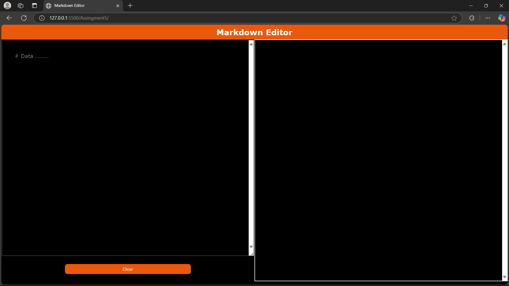
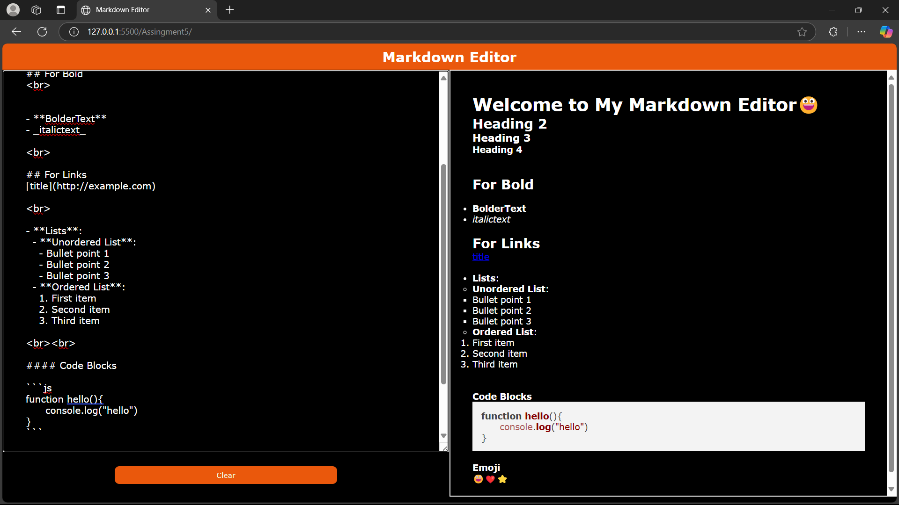
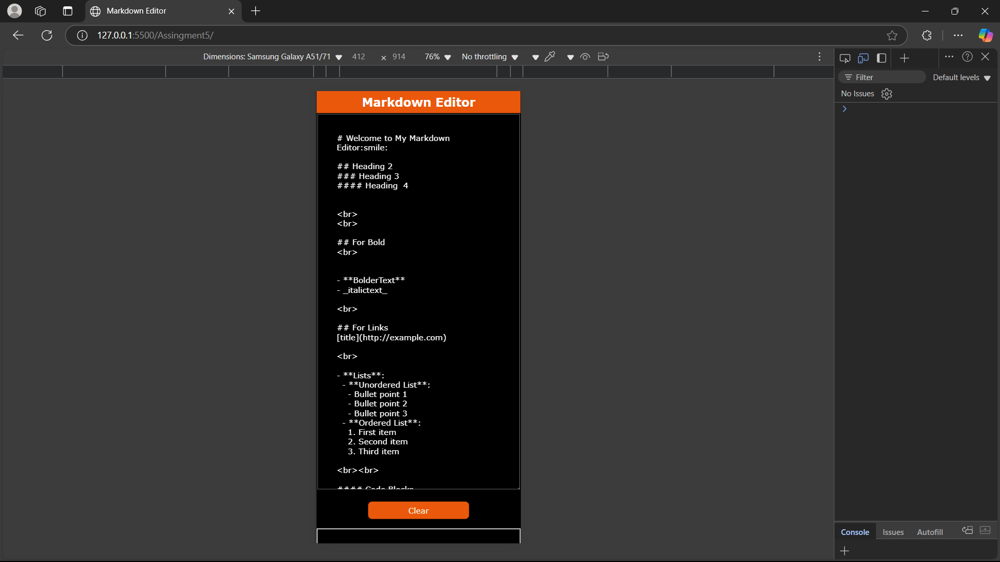
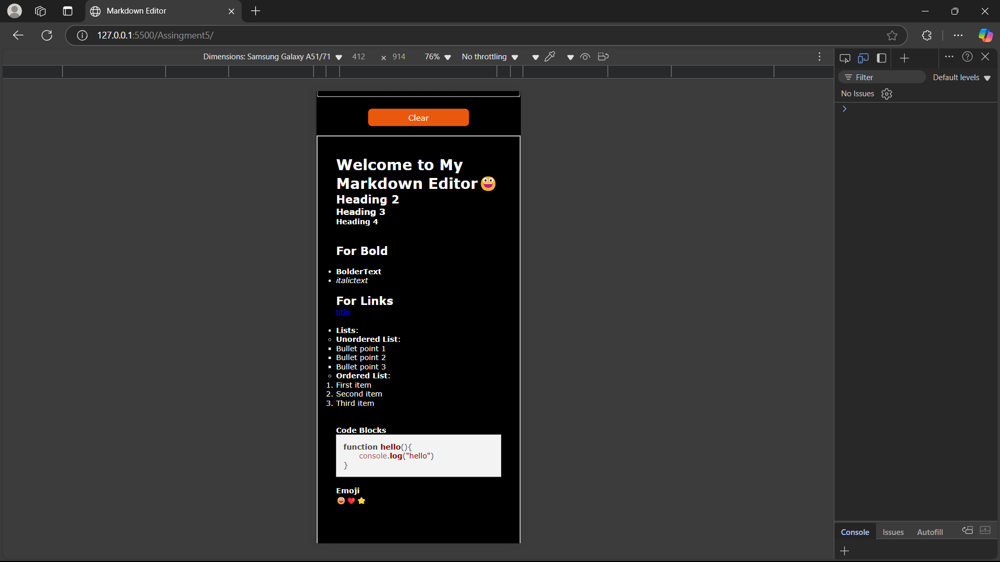

## Features of the Markdown with Emoji Support ✨
### 💻1. Markdown Parsing
The script utilizes the marked library to parse and convert Markdown-formatted text into HTML. This allows users to write in Markdown syntax and see the formatted output in real-time.

### Ⓜ️Supported Markdown Features:
- Headings (# Heading 1, ## Heading 2, etc.)

- Bold and Italic Text (**bold**, *italic*)
- Lists (- Bullet point and 1. Numbered list)

- Links ([Click here](https://example.com))

- Code Blocks (javascript console.log("Hello") )

- Blockquotes (> Quoted text)

### ⌚ Real-time Rendering
Whenever the user types in the textarea , the script automatically parses and renders the content in the preview section div id="content-right".

### 📔 Syntax Highlighting for Code Blocks
Using the highlight.js library, the script applies syntax highlighting to code blocks within Markdown content.

When code is enclosed within triple backticks (```), the script detects the programming language and applies appropriate syntax styling.

The DOMContentLoaded event ensures that all "pre" ,"code" blocks are properly highlighted when the page loads.

### 😂 Emoji Support
The script includes a dictionary (emojiMap) that maps emoji codes (e.g., :smile:) to their corresponding Unicode characters (😃).

When users enter an emoji code, the script replaces it with the actual emoji.

Examples:
```
:heart: → ❤️

:rocket: → 🚀

:fire: → 🔥

:clap: → 👏
```

### 🧹Clear Button Functionality
A Clear button allows users to reset the input field and the rendered content.

When clicked, it sets both the textarea and the preview area to an empty string.

### 🎯Performance Optimization
Uses marked.setOptions({ highlight: function (code) { return hljs.highlightAuto(code).value; } }) to ensure efficient highlighting.

Uses Object.keys(emojiMap).reduce(...) for optimized emoji replacement.

### 👥User-Friendly Interface
The live preview updates instantly as the user types.

Supports a wide range of Markdown and emoji features, making it ideal for note-taking, blogging, or documentation writing.

## Snapshots 📷
### Desktop 




### Responsive 📷


